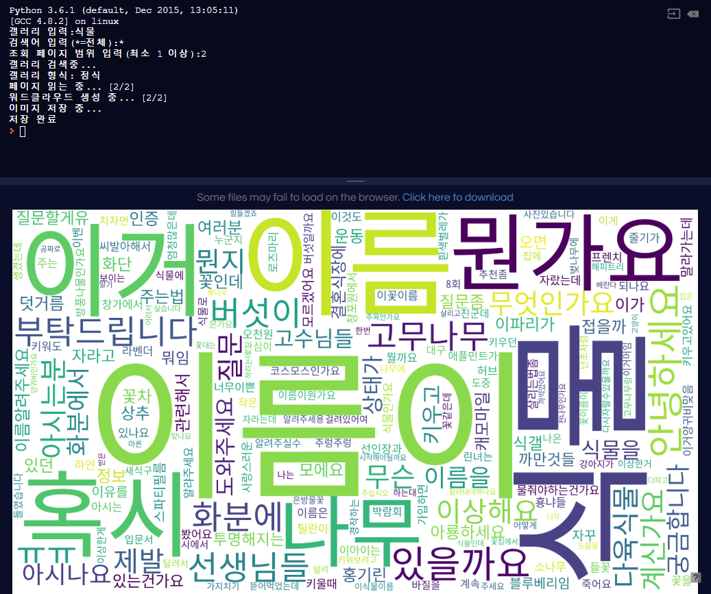

# dc_wordcloud
dcinside 워드클라우드 이미지 생성 파이썬 스크립트

## 사용법
1. `pip install requests bs4 lxml matplotlib wordcloud` 로 필요한 패키지를 설치합니다

2. 스크립트 폴더 안에 사용할 폰트를 넣고 파일명을 `font.otf`로 설정합니다. (`*.ttf` 형식의 클리어타입일 경우 스크립트 맨 위의 `fontpath='font.otf'` 부분을 변경하시면 됩니다)

3. 스크립트를 실행합니다. 순서대로 갤러리 이름, 검색어, 페이지 범위를 입력합니다.

4. 처리가 완료되고 생성되는 두 이미지 파일 (title.png, nick.png) 파일을 확인합니다.
